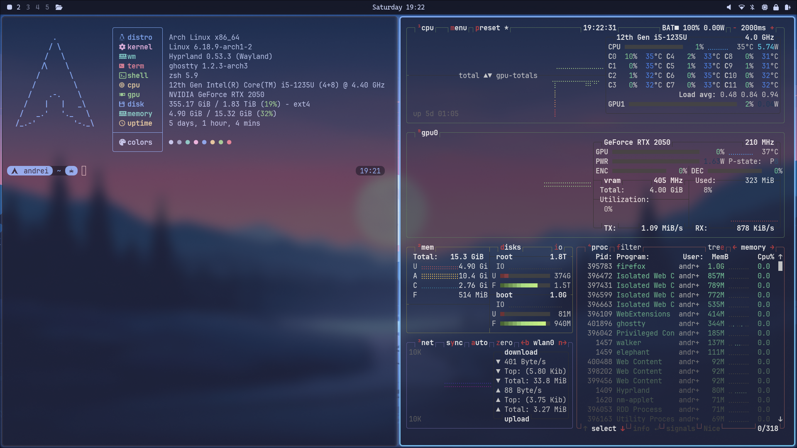
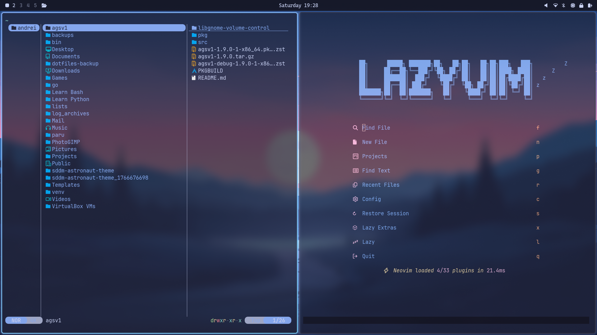
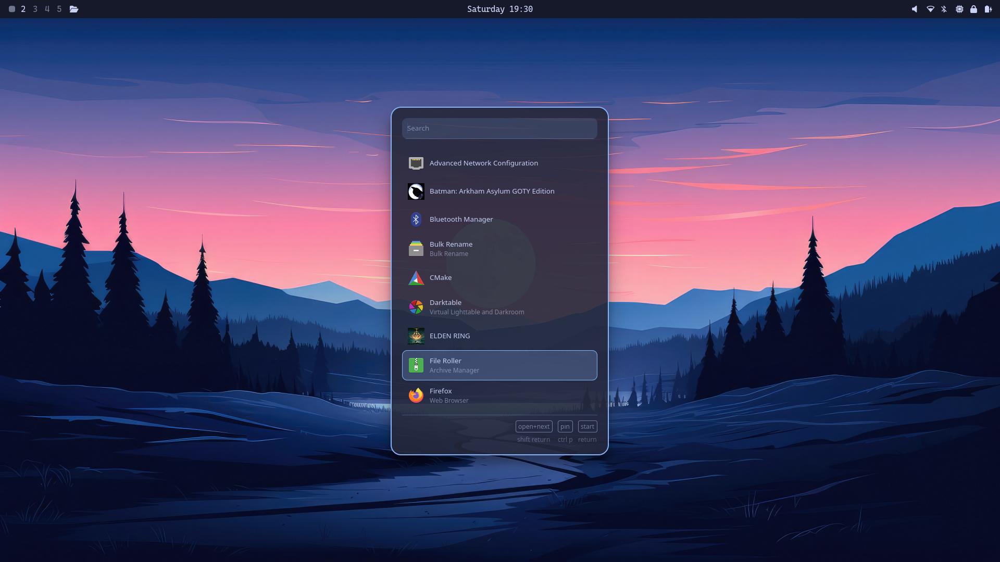

# 🌌 Blue Synth Hyprland 

A highly optimized, efficient Wayland setup for Arch Linux. Designed for keyboard-driven workflows, aggressive battery saving on hybrid laptops, and a clean, deep-blue aesthetic.

## ✨ Key Features

* **Window Manager:** Hyprland (Wayland) with custom animations and 2px/4px gaps.
* **Terminal:** Ghostty
* **Editor:** Neovim (LazyVim distribution)
* **File Manager:** Yazi
* **Launcher:** Walker (with background blur)
* **Bar:** Waybar (Custom layout)

---

## 📸 Workflow

**The Tiling Experience (Yazi + LazyVim)**

**The Application Launcher (Walker)**

---

## ⌨️ Essential Keybinds

| Keybind | Action |
| :--- | :--- |
| `Super + Q` | Open Terminal (Ghostty) |
| `Super + Space` | Open App Launcher (Walker) |
| `Super + W` | Close Window |
| `Super + B` | Open web browser (Firefox) |
| `Print` | Fullscreen Screenshot |
| `Shift + Print` | Select Area Screenshot |

---

## 🚀 Installation

Ready to install? Choose your path:

* Automatic Installation: `git clone https://github.com/YOUR_USERNAME/YOUR_REPO_NAME.git ~/dotfiles && cd ~/dotfiles && chmod +x install.sh && ./install.sh`
* **[Manual Installation Guide](INSTALL.md)**
